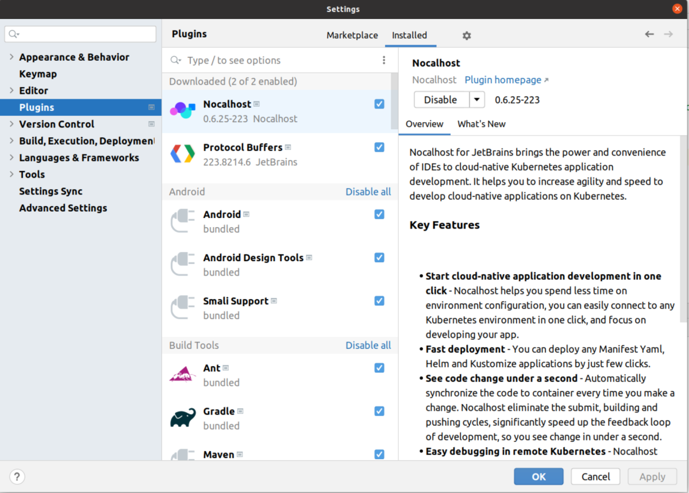
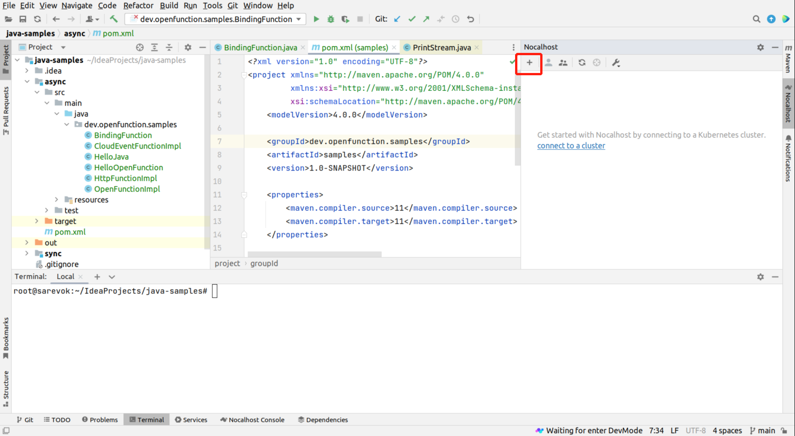
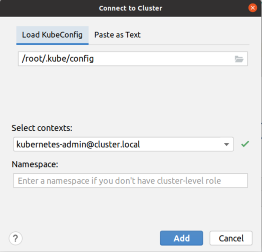
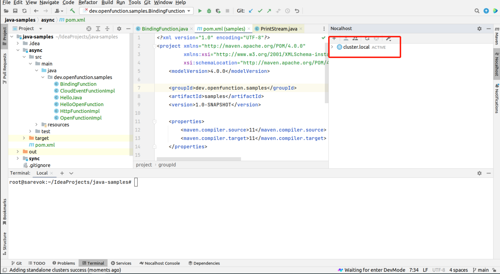
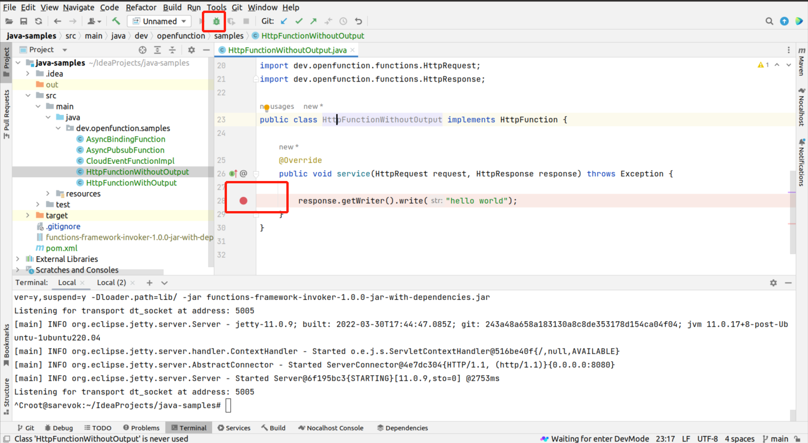
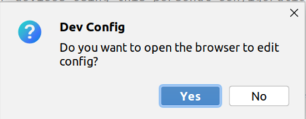
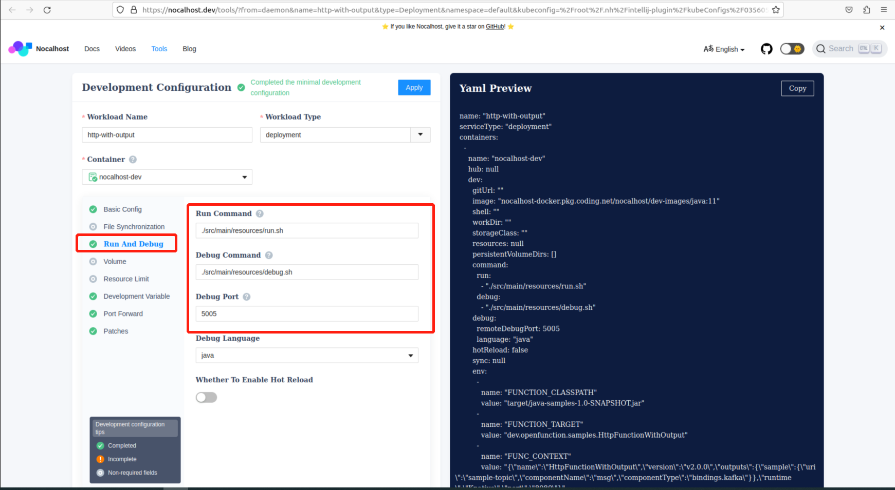
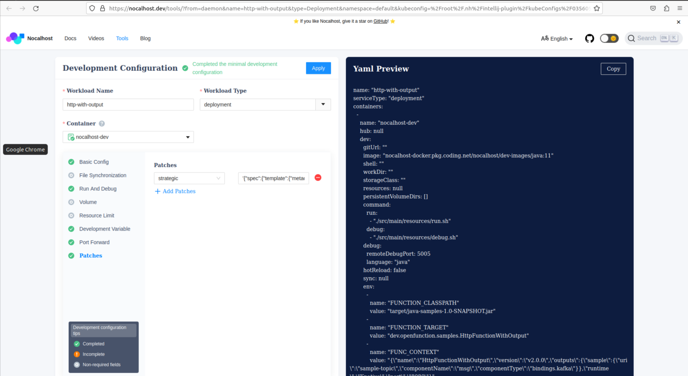
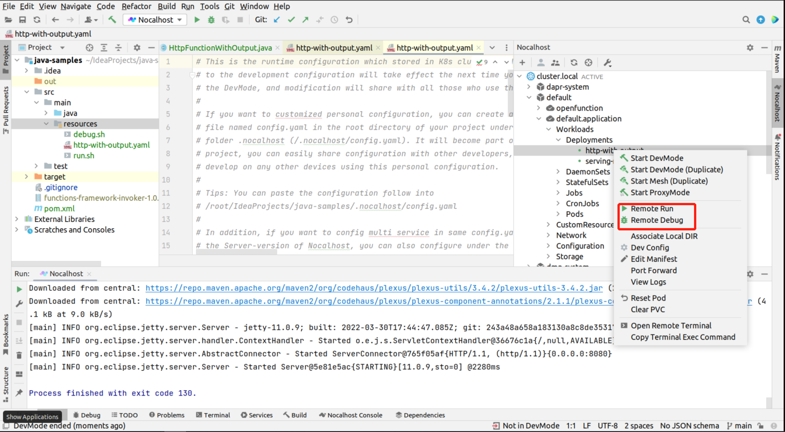

# 环境准备

## 服务端

准备一个 k8s 集群作为服务端，并部署 [OpenFunction](https://openfunction.dev/docs/getting-started/installation/)。

## 客户端

准备一台客户机，在客户机上部署 Intellij IDEA 用于开发调试 OpenFunction 函数。客户机可以是 k8s 集群中的一个节点，也可以是独立的服务器。若客户机为独立的服务器，需将 k8s 集群的 kube config 文件拷贝到客户机上。

### Nocalhost

打开 IDEA， 点击 **File**=》**Settings**



选择 **Plugins**，在 **Marketplace**中搜索 **nocalhost，**点击安装，安装完成后会重启 IDEA。

在 IDEA 中导入 项目 [java-samples](https://github.com/OpenFunction/java-samples.git)，如需创建新的项目，可以根据此项目进行修改。

点击最右侧 Nocalhost 选项


添加集群



选择 kube config 文件



或者粘贴 kube config 文件


点击新创建的集群，若能访问集群资源，则 Nocalhost 连接集群成功



### Framework Jar

下载最新的 [function-framework-invoker](https://repo.maven.apache.org/maven2/dev/openfunction/functions/functions-framework-invoker/1.1.0/functions-framework-invoker-1.1.0-jar-with-dependencies.jar) 到项目目录。

### 打包项目

```shell
mvn package dependency:copy-dependencies
```

打包完成，会在项目下生成 **target** 目录，且在 **target** 目录下生成 jar 包 **java-samples-1.0-SNAPSHOT.jar**.

# 调试函数

## 不使用 output 的同步函数

示例函数 [**HttpFunctionWithoutOutput**](../src/main/java/dev/openfunction/samples/HttpFunctionWithoutOutput.java)

### 创建 Remote JVM Debug


参数默认即可，**module classpath** 选择待调试函数所在的 `module`。

### 运行函数
   
运行以下命令

```shell
export FUNCTION_CLASSPATH=target/java-samples-1.0-SNAPSHOT.jar:target/dependency/*
export FUNCTION_TARGET=dev.openfunction.samples.HttpFunctionWithoutOutput
export FUNC_CONTEXT="{\"name\":\"HttpFunctionWithoutOutput\",\"version\":\"v2.0.0\",\"runtime\":\"Knative\",\"port\":\"8080\"}"
java -Xdebug -Xrunjdwp:transport=dt_socket,address=5005,server=y,suspend=y -Dloader.path=lib/ -jar functions-framework-invoker-1.1.0-jar-with-dependencies.jar
```

> **FUNCTION_CLASSPATH** 为包含函数的 jar 包的路径，及函数依赖的 jar 包的路径，本示例中依赖被复制到 **target/dependency/** 目录下。

> **FUNCTION_TARGET** 为函数的类名。

> **FUNC_CONTEXT** 定义了执行函数所需的参数。

### 启动调试

为函数添加断点，启动上文中创建的 **Remote JVM Debug**



调用函数，执行

```shell
curl localhost:8080
```

即可进入断点

## 使用 output 的同步函数

示例函数 [**HttpFunctionWithOutput**](../src/main/java/dev/openfunction/samples/HttpFunctionWithOutput.java)，本示例函数接收 HTTP 请求，并将请求体中的数据写入 kafka。

安装 [kafka](https://github.com/OpenFunction/samples/blob/main/Prerequisites.md#kafka)，已有 kafka 集群跳过此。创建 **topic** `samples`。

创建 kafka **Component。**

```shell
cat <<EOF | kubectl apply -f -
apiVersion: dapr.io/v1alpha1
kind: Component
metadata:
  name: http-with-output
spec:
  type: bindings.kafka
  version: v1
  metadata:
    - name: brokers
	  value: "kafka-server-kafka-brokers:9092"
	- name: authRequired
	  value: "false"
	- name: publishTopic
	  value: "samples"
	- name: topics
	  value: "samples"
	- name: consumerGroup
	  value: "http-with-output"
EOF
```

创建 deployment

```shell
kubectl apply -f ../src/main/resources/http-with-output.yaml
```

在 **IDEA** 中打开 **Nocalhost**，选择上文中创建的 `deployment` ，右键选择 **Dev Config**


选择 **Yes** 会在浏览器中进行配置（需要联网），选择 **No**会在 **IDEA** 中打开配置文件。



设置启动命令



- Run Command

```
./src/main/resources/nocalhost/run.sh
```

- Debug Command

```
./src/main/resources/nocalhost/run.sh
```

- Debug Port

```
5005
```

设置环境变量


- FUNCTION_CLASSPATH

```
target/java-samples-1.0-SNAPSHOT.jar:target/dependency/*
```

- FUNCTION_TARGET

```
dev.openfunction.samples.HttpFunctionWithOutput
```

- FUNC_CONTEXT

```
{"name":"HttpFunctionWithOutput","version":"v2.0.0","outputs":{"http-with-output":{"uri":"samples","componentName":"msg","componentType":"bindings.kafka"}},"runtime":"Knative","port":"8080"}
```

设置端口映射


> 用户通过映射的端口访问函数。

配置 Patches



```
{"spec":{"template":{"metadata":{"annotations":{"dapr.io/app-id":"http-with-output", "dapr.io/app-port": "8080", "dapr.io/app-protocol":"grpc","dapr.io/enabled":"true","dapr.io/log-as-json": "true","dapr.io/log-level":"debug"}}}}}
```

**PS：patch 的目的是为 Nocalhost 的 pod 注入 dapr sidecar。**

点击 Apply，保存配置。

完整的配置文件如下

```yaml
  name: "http-with-output"
  serviceType: "deployment"
  containers: 
    - 
      name: "nocalhost-dev"
      hub: null
      dev: 
        gitUrl: ""
        image: "nocalhost-docker.pkg.coding.net/nocalhost/dev-images/java:11"
        shell: ""
        workDir: ""
        storageClass: ""
        resources: null
        persistentVolumeDirs: []
        command: 
          run: 
            - "./src/main/resources/nocalhost/run.sh"
          debug: 
            - "./src/main/resources/nocalhost/debug.sh"
        debug: 
          remoteDebugPort: 5005
          language: "java"
        hotReload: false
        sync: null
        env: 
          - 
            name: "FUNCTION_CLASSPATH"
            value: "target/java-samples-1.0-SNAPSHOT.jar"
          - 
            name: "FUNCTION_TARGET"
            value: "dev.openfunction.samples.HttpFunctionWithOutput"
          - 
            name: "FUNC_CONTEXT"
            value: "{\"name\":\"HttpFunctionWithOutput\",\"version\":\"v2.0.0\",\"outputs\":{\"sample\":{\"uri\":\"sample-topic\",\"componentName\":\"msg\",\"componentType\":\"bindings.kafka\"}},\"runtime\":\"Knative\",\"port\":\"8080\"}"
        portForward: 
          - "8080:8080"
        patches: 
          - 
            patch: "{\"spec\":{\"template\":{\"metadata\":{\"annotations\":{\"dapr.io/app-id\":\"http-with-output\", \"dapr.io/app-port\": \"8080\", \"dapr.io/app-protocol\":\"grpc\",\"dapr.io/enabled\":\"true\",\"dapr.io/log-as-json\": \"true\",\"dapr.io/log-level\":\"debug\"}}}}}"
            type: "strategic"

```

启动 debug，等待函数启动成功。



第一次执行需要关联代码目录，选择项目目录即可


> 选择 **Remote Run** 会运行函数，选择 **Remote Debug** 会启动 debug。

> 运行 **Remote Run 或 Remote Debug**会进入 **DevMode**，**Nocalhost** 会将关联目录下的所有文件复制到远端容器内，当本地文件发生变化时会实时同步到远端。如果修改了 **Dev Config**，需要退出 **DevMode** 后，重新运行 **Remote Run** 或 **Remote Debug**。

访问函数，即可进入 `debug` 模式

```shell
curl -i -X POST "http://localhost:8080/" \
   -H "Content-Type: application/json" \
   -d '{"message": "hello world"}'
```

## CloudEvent 函数

示例函数 [**CloudEventFunctionImpl**](../src/main/java/dev/openfunction/samples/CloudEventFunctionImpl.java)


### 创建 **Remote JVM Debug**，


参数默认即可，**module classpath** 选择待调试函数所在的 `module`。

### 运行函数
    
运行以下命令

```shell
export FUNCTION_CLASSPATH=target/java-samples-1.0-SNAPSHOT.jar:target/dependency/*
export FUNCTION_TARGET=dev.openfunction.samples.CloudEventFunctionImpl
export FUNC_CONTEXT="{\"name\":\"CloudEventFunctionImpl\",\"version\":\"v2.0.0\",\"runtime\":\"Knative\",\"port\":\"8080\"}"
java -Xdebug -Xrunjdwp:transport=dt_socket,address=5005,server=y,suspend=y -Dloader.path=lib/ -jar functions-framework-invoker-1.1.0-jar-with-dependencies.jar
```

为函数添加断点，启动上文创建的 **Remote JVM Debug**，调用函数，执行

```shell
curl -i -X POST "http://localhost:8080/" \
   -H "Content-Type: application/cloudevents+json" \
   -d '{"specversion":"1.0","type":"dev.knative.samples.helloworld","source":"dev.knative.samples/helloworldsource","id":"536808d3-88be-4077-9d7a-a3f162705f79","data":"{\"data\":\"hello world\"}"}'
```

即可进入断点

## 异步函数

示例函数 [**AsyncFunction**](../src/main/java/dev/openfunction/samples/AsyncFunction.java)，此函数从 kafka 接收数据，并将数据写入kafka。


安装 [kafka](https://github.com/OpenFunction/samples/blob/main/Prerequisites.md#kafka)，已有 kafka 集群跳过此步骤。 创建 topic **input、output**。

创建 kafka **Component**。

```shell
cat <<EOF | kubectl apply -f -
apiVersion: dapr.io/v1alpha1
kind: Component
metadata:
  name: async-input
spec:
  type: bindings.kafka
  version: v1
  metadata:
    - name: brokers
	  value: "kafka-server-kafka-brokers:9092"
	- name: authRequired
	  value: "false"
	- name: publishTopic
	  value: "input"
	- name: topics
	  value: "input"
	- name: consumerGroup
	  value: "async-input"

---
apiVersion: dapr.io/v1alpha1
kind: Component
metadata:
  name: async-output
spec:
  type: bindings.kafka
  version: v1
  metadata:
    - name: brokers
	  value: "kafka-server-kafka-brokers:9092"
	- name: authRequired
	  value: "false"
	- name: publishTopic
	  value: "output"
	- name: topics
	  value: "output"
	- name: consumerGroup
	  value: "async-output"
EOF
```

创建 deployment

```shell
kubectl apply -f src/main/resources/async-function.yaml
```

参考上文配置 **Nocalhost** 的步骤配置 **Dev Config**。完整的配置文件如下

```yaml
  name: "async-function"
  serviceType: "deployment"
  containers: 
    - name: "nocalhost-dev"
      hub: null
      dev: 
        gitUrl: ""
        image: "nocalhost-docker.pkg.coding.net/nocalhost/dev-images/java:11"
        shell: ""
        workDir: ""
        storageClass: ""
        resources: null
        persistentVolumeDirs: []
        command: 
          run: 
            - "./src/main/resources/nocalhost/run.sh"
          debug: 
            - "./src/main/resources/nocalhost/debug.sh"
        debug: 
          remoteDebugPort: 5005
          language: "java"
        hotReload: false
        sync: null
        env: 
          - 
            name: "FUNCTION_CLASSPATH"
            value: "target/java-samples-1.0-SNAPSHOT.jar"
          - 
            name: "FUNCTION_TARGET"
            value: "dev.openfunction.samples.AsyncFunction"
          - 
            name: "FUNC_CONTEXT"
            value: "{\"name\":\"AsyncFunction\",\"version\":\"v2.0.0\",\"inputs\":{\"input\":{\"uri\":\"input\",\"componentName\":\"async-input\",\"componentType\":\"bindings.kafka\"}},\"outputs\":{\"output\":{\"uri\":\"output\",\"componentName\":\"async-output\",\"componentType\":\"bindings.kafka\"}},\"runtime\":\"Async\",\"port\":\"8080\"}"
        portForward: 
          - "8080:8080"
        patches: 
          - 
            type: "strategic"
            patch: "{\"spec\":{\"template\":{\"metadata\":{\"annotations\":{\"dapr.io/app-id\":\"http-with-output\", \"dapr.io/app-port\": \"8080\", \"dapr.io/app-protocol\":\"grpc\",\"dapr.io/enabled\":\"true\",\"dapr.io/log-as-json\": \"true\",\"dapr.io/log-level\":\"debug\"}}}}}"
```

启动 **Remote Debug**，等待函数启动成功。 向 input topic 中写入数据即可触发断点。


